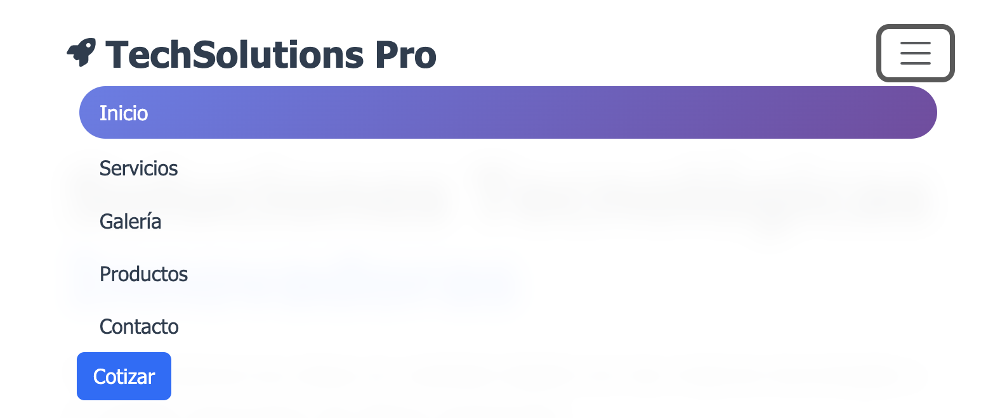
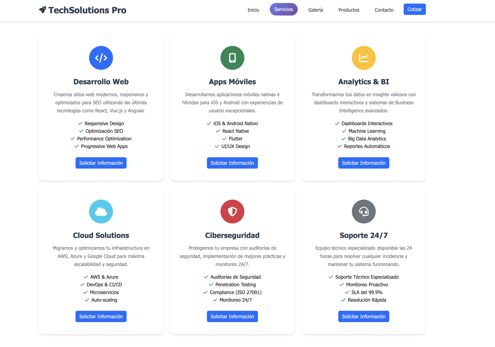

# 🚀 TechSolutions Pro

> **Sitio web responsivo desarrollado con Bootstrap 5** - Proyecto académico de Desarrollo Frontend

[](https://getbootstrap.com/)
[](https://developer.mozilla.org/en-US/docs/Web/HTML)
[](https://developer.mozilla.org/en-US/docs/Web/CSS)
[](https://developer.mozilla.org/en-US/docs/Web/JavaScript)

## 📋 Tabla de Contenidos

- [📖 Descripción](#-descripción)
- [✨ Características](#-características)
- [🛠️ Tecnologías](#️-tecnologías)
- [📱 Responsive Design](#-responsive-design)
- [🏗️ Estructura del Proyecto](#️-estructura-del-proyecto)
- [🚀 Componentes Bootstrap Implementados](#-componentes-bootstrap-implementados)
- [📸 Evidencias Visuales](#-evidencias-visuales)
- [💻 Instalación y Uso](#-instalación-y-uso)
- [📄 Páginas del Sitio](#-páginas-del-sitio)
- [🔧 Características Técnicas](#-características-técnicas)
- [📜 Licencia](#-licencia)
- [👨‍💻 Desarrollador](#-desarrollador)

## 📖 Descripción

**TechSolutions Pro** es un sitio web corporativo completamente responsivo desarrollado como proyecto académico para la asignatura de **Desarrollo Frontend**. El sitio presenta servicios tecnológicos empresariales y demuestra la implementación profesional de **Bootstrap 5** con componentes avanzados y **JavaScript ES6+** para interactividad dinámica.

### 🎯 Objetivos del Proyecto
- Implementar Bootstrap 5 correctamente con archivos locales
- Crear una navegación responsiva funcional
- Desarrollar un carrusel con transiciones automáticas
- Estructurar contenido con el sistema de cuadrículas
- Implementar tarjetas de contenido adaptables
- **Manipular el DOM dinámicamente con JavaScript**
- **Implementar eventos interactivos (click, mouseover, submit)**
- **Integrar Fetch API para carga de datos externos**
- Aplicar convenciones de desarrollo frontend profesional

## ✨ Características

### 🌟 Funcionalidades Principales
- **Diseño 100% Responsivo** - Adaptable a móviles, tablets y desktop
- **Navegación Inteligente** - Navbar que colapsa en dispositivos móviles
- **Carrusel Automático** - Cambio de imágenes cada 3 segundos
- **Filtrado Dinámico** - Sistema de filtros JavaScript en página de productos
- **Formularios Validados** - Validación en tiempo real con Bootstrap
- **Animaciones Suaves** - Efectos CSS y JavaScript integrados
- **Manipulación DOM Dinámica** - Creación y modificación de elementos en tiempo real
- **Eventos Interactivos** - Click, mouseover y submit handlers implementados
- **Carga de Datos Externa** - Fetch API para contenido dinámico desde JSON
- **Gestión de Estados** - Validación académica y logging de funcionalidades

### 🎨 Diseño Visual
- **Paleta de Colores Moderna** - Variables CSS personalizadas
- **Tipografía Profesional** - Google Fonts (Inter)
- **Iconografía Consistente** - Font Awesome 6.4.0
- **Efectos Visuales** - Sombras, gradientes y transiciones

## 🛠️ Tecnologías

### Frontend Stack
```bash
📦 Bootstrap 5.3.2 (Local)     # Framework CSS principal
🎨 CSS3 Variables              # Estilos personalizados
⚡ JavaScript ES6+             # Interactividad y manipulación DOM
🌐 Fetch API                   # Carga asíncrona de datos externos
🎯 Event Handling              # Click, mouseover, submit events
🔄 DOM Manipulation            # createElement, appendChild, innerHTML
🔤 Font Awesome 6.4.0          # Iconografía profesional
📝 Google Fonts (Inter)        # Tipografía moderna
```

### Herramientas de Desarrollo
- **HTML5 Semántico** - Estructura accesible y SEO-friendly
- **CSS Grid & Flexbox** - Layout moderno y flexible
- **JavaScript Vanilla** - Sin dependencias externas adicionales
- **Intersection Observer API** - Animaciones en scroll
- **Promise-based Architecture** - Manejo asíncrono con async/await
- **Error Handling** - Gestión robusta de errores en Fetch API

## 📱 Responsive Design

El sitio implementa un enfoque **mobile-first** con breakpoints específicos:

```css
/* Breakpoints Bootstrap utilizados */
xs: <576px    /* Móviles */
sm: ≥576px    /* Móviles grandes */
md: ≥768px    /* Tablets */
lg: ≥992px    /* Desktop */
xl: ≥1200px   /* Desktop grande */
```

### Sistema de Cuadrículas
```html
<!-- Ejemplo de grid responsivo implementado -->
<div class="col-12 col-md-6 col-lg-4">
  <!-- 1 columna móvil, 2 tablet, 3 desktop -->
</div>
```

## 🏗️ Estructura del Proyecto

```
bootstrapweb/
├── 📁 css/
│   ├── bootstrap.min.css       # Bootstrap 5.3.2 local
│   ├── bootstrap.css.map
│   └── style.css              # Estilos personalizados
├── 📁 js/
│   ├── bootstrap.bundle.min.js # Bootstrap JavaScript
│   └── main.js                # JavaScript personalizado
├── 📁 evidencias/             # Capturas de pantalla
│   ├── index.png              # Vista desktop principal
│   ├── Nav-mobile.png         # Navbar móvil
│   ├── NAV-web.png            # Navbar desktop
│   ├── Productos-cards.png    # Página productos
│   ├── Servicios-grid.png     # Página servicios
│   ├── Galeria-carrusel.png   # Carrusel de galería
│   └── Footer.png             # Footer del sitio
├── 📁 images/                 # Recursos gráficos
├── 📄 index.html              # Página principal
├── 📄 servicios.html          # Catálogo de servicios
├── 📄 galeria.html            # Carrusel de proyectos
├── 📄 productos.html          # Productos con filtros
├── 📄 contacto.html           # Formulario de contacto
├── 📄 README.md               # Este archivo
└── 📄 LICENSE                 # Licencia del proyecto
```

## 🚀 Componentes Bootstrap Implementados

### 1. 🧭 Navbar Responsivo
```html
<nav class="navbar navbar-expand-lg fixed-top">
  <button class="navbar-toggler" data-bs-toggle="collapse">
    <!-- Colapso automático en móviles -->
  </button>
</nav>
```

### 2. 🎠 Carrusel Automático
```html
<div id="imageCarousel" class="carousel slide carousel-fade" 
     data-bs-ride="carousel" data-bs-interval="3000">
  <!-- Cambio automático cada 3 segundos -->
</div>
```

### 3. 🃏 Sistema de Tarjetas
```html
<div class="card h-100">
  <!-- Tarjetas uniformes con altura consistente -->
</div>
```

### 4. 📋 Formularios Validados
```html
<form class="needs-validation" novalidate>
  <!-- Validación Bootstrap integrada -->
</form>
```

## 🔥 Funcionalidades JavaScript Implementadas

### 1. 🎛️ Manipulación del DOM Dinámica
```javascript
// Creación dinámica de elementos de estadísticas
function createStatElement(stat, index) {
    const colElement = document.createElement('div');
    colElement.className = 'col-6 col-md-3';
    
    const statElement = document.createElement('div');
    statElement.className = 'text-center';
    
    // Ícono dinámico
    const iconElement = document.createElement('div');
    iconElement.innerHTML = `<i class="${stat.icono} fs-1 text-white"></i>`;
    
    // Contador animado
    const numberElement = document.createElement('h3');
    numberElement.setAttribute('data-target', stat.numero);
    
    return colElement;
}
```

### 2. 🎯 Sistema de Eventos Interactivos
```javascript
// Eventos Click - Filtros de productos
filterButtons.forEach(button => {
    button.addEventListener('click', function() {
        const filter = this.getAttribute('data-filter');
        filterProducts(filter);
    });
});

// Eventos Mouseover - Efectos hover dinámicos
cards.forEach(card => {
    card.addEventListener('mouseenter', function() {
        this.classList.add('hover-effect');
    });
});

// Eventos Submit - Validación de formularios
contactForm.addEventListener('submit', function(e) {
    e.preventDefault();
    validateForm(this);
});
```

### 3. 🌐 Integración Fetch API
```javascript
// Carga de datos externos desde archivos JSON
async function fetchData(url) {
    try {
        const response = await fetch(url);
        if (!response.ok) {
            throw new Error(`HTTP error! status: ${response.status}`);
        }
        const data = await response.json();
        return data;
    } catch (error) {
        handleFetchError(error);
        return null;
    }
}

// Implementación específica para estadísticas
async function loadEstadisticas() {
    const data = await fetchData('./data/estadisticas.json');
    if (data) {
        data.estadisticas.forEach((stat, index) => {
            const statElement = createStatElement(stat, index);
            containerElement.appendChild(statElement);
        });
        animateCounters();
    }
}
```

### 4. 📊 Funciones de Utilidad y Validación
```javascript
// Animación de contadores
function animateCounters() {
    const counters = document.querySelectorAll('.counter');
    counters.forEach(counter => {
        const target = parseInt(counter.getAttribute('data-target'));
        const increment = target / 200;
        // Lógica de animación...
    });
}

// Validación académica y logging
function initializeBasicLogs() {
    console.log('DOM manipulation inicializado');
    console.log('Fetch API inicializado');
    console.log('Mouse over inicializado');
    console.log('Click events inicializado');
    console.log('Submit events inicializado');
}
```

## 📸 Evidencias Visuales

### 🖥️ Vista Desktop

*Página principal con hero section y estadísticas*

### 📱 Vista Móvil - Navbar

*Navegación colapsada funcionando correctamente*

### 🖥️ Navegación Desktop

*Navegación expandida con todos los elementos visibles*

### 🛍️ Página de Productos (Cards)

*Sistema de filtrado dinámico y grid responsivo*

### 🔧 Página de Servicios (Grid)

*Tarjetas de servicios organizadas en grid Bootstrap*

### 🖼️ Galería con Carrusel

*Carrusel automático con controles de navegación*

### 🦶 Footer del Sitio

*Footer con información de contacto y enlaces*

## 💻 Instalación y Uso

### Requisitos Previos
- Navegador web moderno (Chrome, Firefox, Safari, Edge)
- Servidor web local (opcional, para desarrollo)

### Pasos de Instalación

1. **Clonar el repositorio**
```bash
git clone [URL-del-repositorio]
cd bootstrapweb
```

2. **Abrir en navegador**
```bash
# Opción 1: Abrir directamente
open index.html

# Opción 2: Servidor local (recomendado)
python -m http.server 8000
# Luego abrir: http://localhost:8000
```

3. **Explorar las páginas**
- `index.html` - Página principal
- `servicios.html` - Catálogo de servicios
- `galeria.html` - Carrusel de proyectos
- `productos.html` - Productos con filtros
- `contacto.html` - Formulario de contacto

## 📄 Páginas del Sitio

### 🏠 **index.html** - Página Principal
- **Hero Section** con call-to-action
- **Estadísticas** animadas con contadores
- **Sección Sobre Nosotros** 
- Grid responsivo `col-lg-6` para contenido/imagen

### 🔧 **servicios.html** - Catálogo de Servicios
- **6 servicios principales** en tarjetas
- Grid `col-12 col-md-6 col-lg-4` (1-2-3 columnas)
- Iconos Font Awesome para cada servicio
- Call-to-action buttons integrados

### 🎨 **galeria.html** - Carrusel de Proyectos ⭐
- **Carrusel Bootstrap** con 5 slides
- **Intervalo automático** de 3 segundos exactos
- Transiciones `carousel-fade` suaves
- Indicadores y controles de navegación

### 🛍️ **productos.html** - Catálogo con Filtros ⭐
- **Sistema de filtros JavaScript** dinámico
- **12 productos** organizados por categorías
- Grid responsive `col-12 col-md-6 col-lg-4`
- Filtros: Todos, Enterprise, Analytics, Seguridad, Cloud

### 📞 **contacto.html** - Formulario de Contacto
- **Formulario completo** con validación Bootstrap
- **4 tarjetas informativas** de contacto
- Grid `col-md-6 col-lg-3` para información
- Enlaces directos (tel:, mailto:, maps)

## 🔧 Características Técnicas

### CSS Personalizado
```css
/* Variables CSS para consistencia */
:root {
  --primary-color: #2c3e50;
  --secondary-color: #3498db;
  --gradient-primary: linear-gradient(135deg, #667eea 0%, #764ba2 100%);
}
```

### JavaScript Funcionalidades
```javascript
// Carrusel con configuración automática
const carousel = new bootstrap.Carousel(carouselElement, {
  interval: 3000,
  pause: 'hover',
  wrap: true
});

// Sistema de filtros dinámico
filterButtons.forEach(button => {
  button.addEventListener('click', function() {
    const filter = this.getAttribute('data-filter');
    // Lógica de filtrado...
  });
});

// Fetch API para carga de datos externos
async function initializeDynamicContent() {
  const data = await fetchData('./data/estadisticas.json');
  if (data) {
    renderStatistics(data.estadisticas);
    animateCounters();
  }
}

// Manipulación DOM dinámica
function createStatElement(stat, index) {
  const element = document.createElement('div');
  element.innerHTML = `<i class="${stat.icono}"></i>`;
  containerElement.appendChild(element);
}
```

### Implementaciones de la Semana 5 - Interactividad JavaScript

#### 🎛️ Manipulación del DOM
- **Creación dinámica de elementos** con `createElement()` y `appendChild()`
- **Modificación de contenido** usando `innerHTML` e `textContent`
- **Gestión de clases CSS** con `classList.add()`, `classList.remove()`
- **Atributos dinámicos** mediante `setAttribute()` y `getAttribute()`

#### 🎯 Sistema de Eventos
- **Click Events**: Filtros de productos, navegación, botones de acción
- **Mouseover Events**: Efectos hover, tooltips, animaciones de tarjetas
- **Submit Events**: Validación de formularios, envío de datos
- **Scroll Events**: Animaciones al hacer scroll, navbar dinámico

#### 🌐 Fetch API Integration
- **Carga asíncrona** de datos desde archivos JSON externos
- **Manejo de promesas** con async/await pattern
- **Error handling** robusto con try-catch blocks
- **Renderizado dinámico** de contenido basado en datos externos

#### 📊 Funcionalidades Específicas
- **Contadores animados** que incrementan desde 0 hasta el valor objetivo
- **Sistema de filtros** en tiempo real para productos
- **Validación de formularios** con feedback visual inmediato
- **Efectos visuales** activados por eventos de usuario

### Optimizaciones Implementadas
- **Lazy Loading** para imágenes
- **Intersection Observer** para animaciones
- **Debouncing** en eventos de scroll
- **Local Storage** para preferencias
- **Progressive Enhancement**

## 📜 Licencia

Este proyecto está bajo la Licencia MIT. Ver el archivo [LICENSE](LICENSE) para más detalles.

## 👨‍💻 Desarrollador

**Desarrollado con ❤️ por:**

<div align="center">

### **SanchezDev.com**

**Rodrigo Sanchez**  
✉️ [rodrigo@sanchezdev.com](mailto:rodrigo@sanchezdev.com)  
🌐 [SanchezDev.com](https://sanchezdev.com)  

---

### 🎓 Proyecto Académico
**DUOC UC - Desarrollo Frontend**  
**Semana 4: Bootstrap 5 para Diseño Responsivo**  
**Semana 5: Manipulación del DOM con JavaScript**  
© 2025 Todos los derechos reservados

</div>

---

<div align="center">

**⭐ Si te gusta este proyecto, dale una estrella en GitHub ⭐**

[🔝 Volver arriba](#-techsolutions-pro)

</div>
